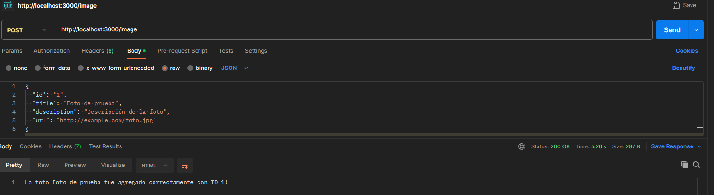
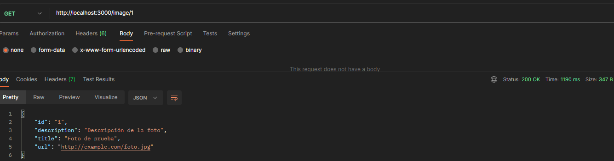
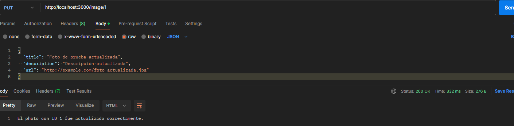
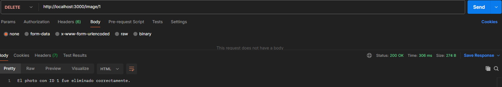

# Photos
Esta es una aplicación de fotos desarrollada en React Native con Expo. 

## Prerrequisitos
- Computadora con las herramientas necesarias instaladas (Node.js, npm, Expo CLI).

## Instalación 

1. Clona este repositorio:
   ```bash
   git clone https://github.com/Khenya/Photos.git

2. Instalar las dependencias de Backend
   ```bash
   cd .\fotos_backend\
   npm i
   ```
   
3. Iniciar el proyecto de Backend
    ```bash
   npm run dev
2. Instalar las dependencias de Frontend
   ```bash
   cd .\fotos\
   npm i
   ```
   
3. Iniciar el proyecto de Backend
    ```bash
   npx expo start
   ```

4. Abrir el proyecto  de Frontend
- Para abrir el proyecto solo nesecitas escanear el qr desde tu celular android o iSO 
  - Para abrir la aplicación desde Android dedes tener la aplicacion **Expo Go**, ingresar a la misma y escanear el código QR que aparece en tu terminal despues de realizar el paso 3.
  - Para abrir la aplicación desde iOS necesitas tener la aplicacion **Expo Go**, ingresar a la camar de tu celular, escanear el código QR que aparece en tu terminal despues de realizar el paso 3, el cual te dara un enlase que te redirecciona a la aplicación **Expo Go**.
  - Para abrir desde un emulador android, despues de realizar el paso 3 debes presionar la tecla **a**
  - Para abrir desde un emulador de iOS, despues de realizar el paso 3 debes presionar la tecla **i**. (Para esta opción necesitas tener una Mac)
7. Abrir el proyecto  de Backend
- Para realizar el CRUD solo nesecitas postman
    - Create

        **Método HTTP:** POST

        **URL:** http://localhost:3000/image
        
        **Body:** Selecciona raw y JSON como tipo de datos.

            Contenido del Body:
            ```json
            {
            "id": "1",
            "title": "Foto de prueba",
            "description": "Descripción de la foto",
            "url": "http://example.com/foto.jpg"
            }

        

    - Read
    
        **Método HTTP:** GET

        **URL:** http://localhost:3000/image/1

        

    - Update

        **Método HTTP:** PUT

        **URL:** http://localhost:3000/image7/1
        
        **Body:** Selecciona raw y JSON como tipo de datos.

            Contenido del Body:
            ```json
            {
                "title": "Foto de prueba actualizada",
                "description": "Descripción actualizada",
                "url": "http://example.com/foto_actualizada.jpg"
            }

        

    - Delete
  
        **Método HTTP:** DELETE

        **URL:** http://localhost:3000/image/1
       

        


## Estructura del Repositorio
```
Photos/
├──fotos/
│   │─ src/
│   │   ├── assets/
│   │   │   └── images/
│   │   ├── components/
│   │   │   └──components/
│   │   │       ├──AlbumItem.jsx
│   │   │       ├──Categories.jsx
│   │   │       ├──LibraryContent.jsx
│   │   │       ├──Memory.jsx
│   │   │       ├──People.jsx
│   │   │       ├──Places.jsx
│   │   │       └──SearchBox.jsx
│   │   ├── config/
│   │   │   └── theme/
│   │   │       └──app-theme.js
│   │   ├── layout/
│   │   │   └──Footer.js
│   │   ├── screens/
│   │   │   ├── AlbumScreen.js
│   │   │   ├── ForYouScreen.js
│   │   │   ├── LibraryScreen.js
│   │   │   └── SearchScreen.js
│   │   ├── services/
│   │   │   ├── catsInstance.js
│   │   │   └── catsService.js
│   ├── App.js
├──fotos_backend/
│   └── src
│       ├── config/
│       │   └── firebaseConfig.js
│       ├── controllers/
│       │   └── PhotoController.js
│       ├── routes/
│       │   └── photo.js
│       ├── services/
│       │   ├── PhotoService.js
│       ├── index.js
├── README.md
```

